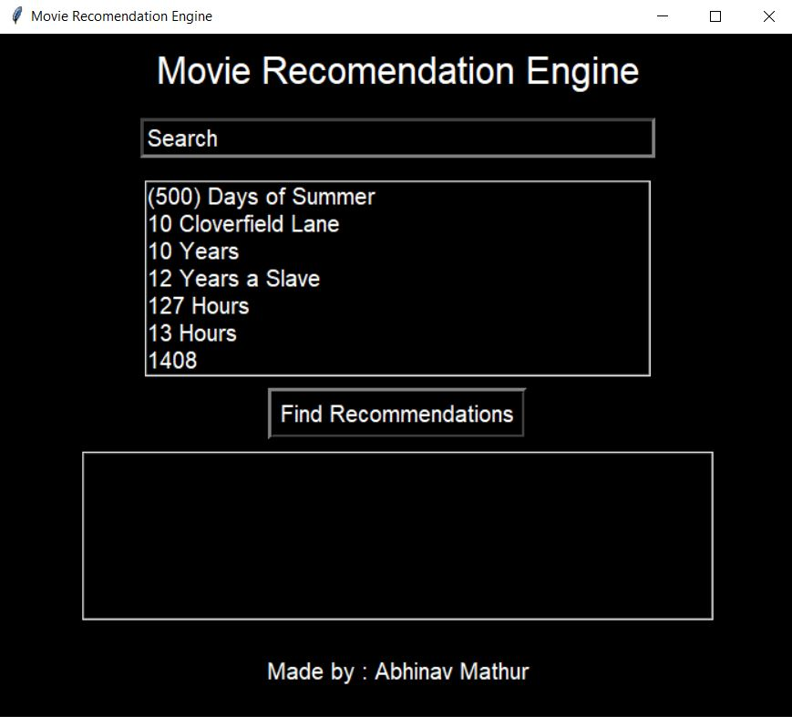
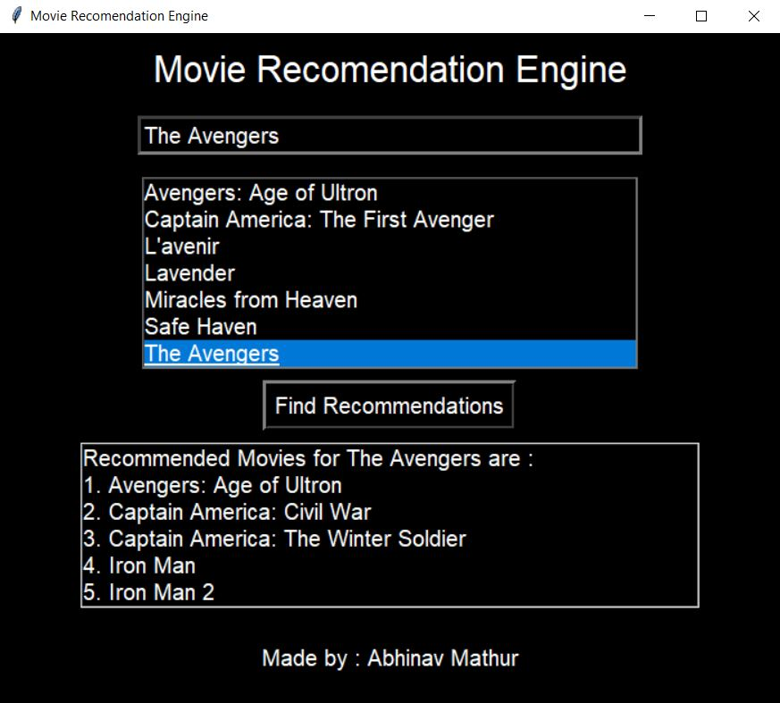

# Movie Recommendation Engine

This is a simple GUI ( Tkinter ) based Movie Recommendation Engine.<br>
It uses cosine_similarity and CountVectorizer on a dataset to determine the most similar movies based on important features of a movie.

# Working

Machine Learning Classifier uses cosine_similarity which can be converted to a distance measure, and then be used in any distance based classifier .<br>The CountVectorizer provides a simple way to both tokenize a collection of text documents and build a vocabulary of known words, but also to encode new documents using that vocabulary. enumerate() function takes cosine_similarity and return similarity_scores which is then used for recommendataion.<br><br>The movie dataset is read with the help of pandas and stored in a dataframe and then passed into the listbox contaning all the movie's title for the user to select a movie to which the user wants recommendations for.<br>The Searchbar is responsive to key touch and loads-up all the movies matching to the text the user has inputted in the listbox.<br>After the user selects and press "Find Recommendations" button, mre() function finds the top 5 Similar movies based on important features and displays it in the listbox below.

# Installation

1. Python 3: https://www.python.org/downloads/
2. Use the package manager [pip](https://pip.pypa.io/en/stable/) to install :
    ```bash
    pip install pandas
    pip install numpy
    pip install -U scikit-learn
    pip install tkintertable
    ```

# Dataset

Dataset for this project can be downloaded [here](https://www.kaggle.com/PromptCloudHQ/imdb-data)<br>
This dataset includes Title, Genre, Description, Director, Actors, Year, Runtime, Rating, Votes, Revenue, Metascrore<br>
The important features of a movie used to find similar recomended movies are Title, Genre, Director, Actors 

# Usage

Search for the Movie in the search section and select the movie from the list and then press find recommendation button <br> <br>You will see top 5 Recommended movies for the movie you have selected